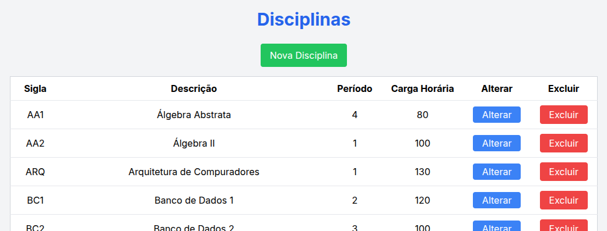
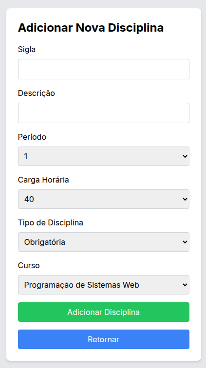
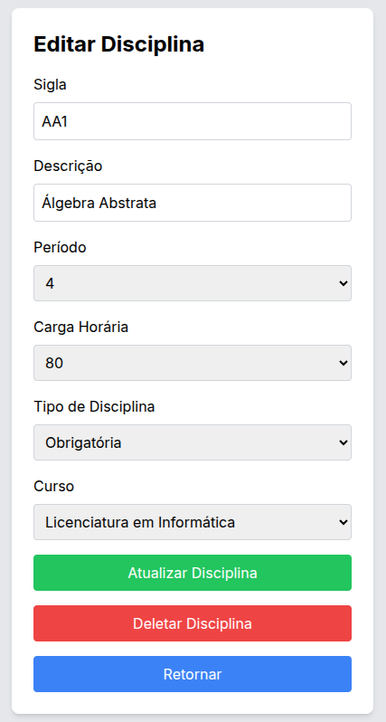

# Exercício: Implementação do CRUD para a Tabela DISCIPLINA

## Objetivo:
O objetivo deste exercício é implementar um CRUD completo para a tabela **DISCIPLINA**, utilizando as mesmas tecnologias e design do CRUD da tabela **PROFESSOR** já discutido. A implementação será baseada em uma API REST configurada no backend e o frontend será desenvolvido utilizando **Next.js**, **TypeScript**, e **TailwindCSS**.

## Configuração do Backend
Nessa etapa do curso, o aluno já deve ter desenvolvido seu próprio backend

## O CRUD deve ser composto por:
1. **Tela Principal**: Apresentará uma lista (grid) de disciplinas.
2. **Tela de Inserção**: Permitir a adição de novas disciplinas.
3. **Tela de Edição**: Permitir a edição de disciplinas existentes.
4. **Backend (API REST)**: Endpoints para todas as operações do CRUD.

## Funcionalidades do Front-End 

## 1. Tela Principal (Grid de Disciplinas)
A tela principal do CRUD de **DISCIPLINA** exibe uma lista de todas as disciplinas cadastradas em formato de **grid**. Esta tela apresenta as seguintes funcionalidades:

- **Carregamento de Dados**:
  - Ao acessar a tela, os dados são carregados da API REST.
  - Enquanto os dados estão sendo carregados, um **spinner** com a mensagem "CARREGANDO..." é exibido abaixo do título "Disciplinas" e centralizado na tela.
  
- **Exibição dos Dados**:
  - O grid exibe as seguintes colunas:
    - **Sigla**: A sigla da disciplina.
    - **Descrição**: O nome ou descrição completa da disciplina.
    - **Período**: O período associado à disciplina.
    - **Carga Horária**: A carga horária total da disciplina.
    - **Ações**: Coluna com botões de ação para **Alterar** e **Excluir**.

- **Ordenação dos Dados**:
  - As disciplinas são listadas em ordem alfabética pela coluna **Descrição**.

- **Ações de CRUD**:
  - **Alterar**: Botão azul que leva à tela de edição de uma disciplina específica. O ID da disciplina é passado na URL.
  - **Excluir**: Botão vermelho que remove a disciplina da base de dados. Após a exclusão, a tela é automaticamente atualizada para refletir as alterações no grid.
  
- **Botão Nova Disciplina**:
  - Botão verde na parte superior que redireciona o usuário para a tela de **inserção** de uma nova disciplina.

---

## 2. Tela de Inserção de Nova Disciplina

A tela de inserção é utilizada para adicionar novas disciplinas ao sistema. Ela contém um formulário com os seguintes campos:

- **Sigla**: Campo de texto para a sigla da disciplina.
- **Descrição**: Campo de texto para a descrição completa da disciplina.
- **Período**: Um combo box com as seguintes opções fixas:
  - 1, 2, 3, 4, 5, 6
- **Carga Horária**: Um combo box com as opções de carga horária:
  - 20, 40, 60, 80
- **Tipo de Disciplina**: Um combo box carregado dinamicamente da API REST, com a lista de tipos de disciplina disponíveis.
- **Curso**: Um combo box carregado dinamicamente da API REST, exibindo os cursos disponíveis.

### Funcionalidades:
- **Carregamento Dinâmico**:
  - Os campos **Tipo de Disciplina** e **Curso** são preenchidos dinamicamente com os dados obtidos da API REST.
  
- **Ação de Inserção**:
  - O botão **Adicionar Disciplina** envia os dados preenchidos para a API REST via requisição **POST**.
  - Após a inserção bem-sucedida, o sistema redireciona o usuário de volta para a tela principal com o grid atualizado.
  
- **Mensagens de Carregamento e Erro**:
  - Se ocorrer um erro durante a inserção, uma mensagem de erro personalizada é exibida.

---

## 3. Tela de Edição de Disciplina

A tela de edição permite que o usuário altere os dados de uma disciplina já existente. Ela contém o mesmo formulário da tela de inserção, com os campos já preenchidos com os dados da disciplina selecionada.

### Funcionalidades:
- **Preenchimento Automático**:
  - Os campos do formulário são automaticamente preenchidos com os valores atuais da disciplina, obtidos da API REST por meio de uma requisição **GET**.

- **Campos Disponíveis**:
  - **Sigla**: Campo de texto editável.
  - **Descrição**: Campo de texto editável.
  - **Período**: Combo box com opções (1 a 6).
  - **Carga Horária**: Combo box com opções (20, 40, 60, 80).
  - **Tipo de Disciplina**: Combo box carregado dinamicamente com os tipos de disciplina.
  - **Curso**: Combo box carregado dinamicamente com os cursos disponíveis.

- **Ação de Edição**:
  - O botão **Atualizar Disciplina** envia uma requisição **PUT** para a API REST, atualizando a disciplina com os novos valores.
  - Após a atualização, o sistema redireciona o usuário para a tela principal com o grid atualizado.

- **Botão Retornar**:
  - Um botão azul **Retornar** permite ao usuário voltar para a tela principal sem realizar nenhuma alteração.

- **Mensagens de Carregamento e Erro**:
  - Mensagens de erro são exibidas caso haja falhas durante a edição.

---

## 4. Estado de Carregamento
- Tanto a tela principal quanto as telas de inserção e edição possuem um estado de carregamento que exibe um **spinner** e a mensagem **CARREGANDO...** enquanto os dados estão sendo recuperados ou enviados para a API REST.
  
- O carregamento é centralizado e visível ao usuário para melhorar a experiência de uso.

## 5. Resultado Final

